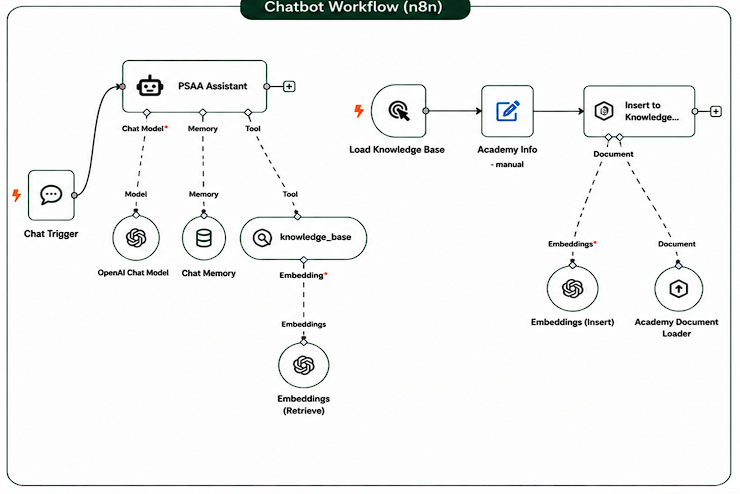

# PSAA Co-op Training Chatbot — n8n Workflow

The real, AI-powered version of the site's chatbot, built as an
[n8n](https://n8n.io/) automation using a LangChain-based agent — separate
from the simple `JS/chatbot.js` demo bundled in the main site (see note
below).

## How it works

- **Chat Trigger** — receives incoming user messages.
- **PSAA Assistant** (the agent) — a LangChain agent node that:
  - uses **OpenAI Chat Model** to generate responses,
  - keeps short-term context with **Chat Memory** (buffer window),
  - can call a **knowledge_base** tool (retrieval-augmented generation) to
    look up facts about the academy before answering.
- **knowledge_base** — an in-memory vector store searched via
  **Embeddings (Retrieve)** (OpenAI embeddings) so the assistant can ground
  its answers in real academy information instead of guessing.
- **Load Knowledge Base → Academy Info → Insert to Knowledge Base** — a
  separate, manually-triggered branch used to (re-)populate the knowledge
  base: it loads academy info, embeds it (**Embeddings (Insert)**), and
  writes it into the vector store via the **Academy Document Loader**.

This gives the assistant retrieval-augmented answers grounded in real
academy content, rather than the fixed keyword → canned-answer list used
by the front-end's demo chatbot.

## Relationship to `JS/chatbot.js` in the main site

The main site currently ships with a **simple keyword-matching chatbot**
(`JS/chatbot.js`) — it has no real AI behind it and was built as a
lightweight placeholder so the chat widget felt functional during
front-end development. This n8n workflow is the actual AI agent designed
to replace it in production. To wire them together, the front-end's
`sendMessage()` would need to call this workflow's webhook URL instead of
its local `getBotReply()` keyword lookup.

## Importing this workflow

1. Open your n8n instance → **Workflows → Import from File**.
2. Select `PSAA-Co-op-Training-Chatbot-n8n.json`.
3. Add your own **OpenAI** credentials in n8n (Settings → Credentials) —
   the exported file references a credential by name/ID only; no API key
   is stored in the JSON itself.
4. Run the **Load Knowledge Base** branch once (manually) to populate the
   vector store before using the chat.
